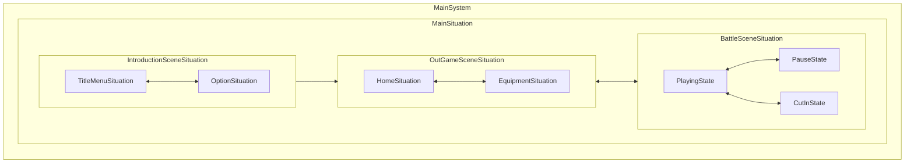

# game-framework
## 概要
Unityでゲーム制作する際のアーキテクチャ設計に関わるフレームワークです

基本的に、以下の要件を重要視した設計になっています
- 実行順の制御を容易にしたい
- 非同期処理を記述する箇所を明確にしたい
- 非同期処理や初期化処理の解放タイミングなどを明確かつシンプルにしたい
- レイヤーを作りすぎず、実装に対してのクラス量を抑えたい
- 仕様の変化になるべく強くしたい

## セットアップ
#### インストール
1. Window > Package ManagerからPackage Managerを開く
2. 「+」ボタン > Add package from git URL
3. 以下を入力してインストール
   * https://github.com/DaitokuAmy/game-framework.git?path=/Packages/com.daitokuamy.gameframework
   

あるいはPackages/manifest.jsonを開き、dependenciesブロックに以下を追記します。

```json
{
    "dependencies": {
        "com.daitokuamy.gameframework": "https://github.com/DaitokuAmy/game-framework.git?path=/Packages/com.daitokuamy.gameframework"
    }
}
```
バージョンを指定したい場合には以下のように記述します。

https://github.com/DaitokuAmy/game-framework.git?path=/Packages/com.daitokuamy.gameframework#1.0.0

## ライフサイクルについて
game-frameworkでは、「Unityにおけるシーン管理」だけでは不足しがちな、ライフサイクルの階層的管理をサポートしています

具体的には
- MainSystem
- Situation
- State

が該当します

### MainSystem
アプリ起動中のライフサイクルを管理するクラスで、Singleton的な動きをします

アプリケーションの以下のサイクルを管理できます
- アプリケーション起動時の初期化処理
- アプリケーションソフトリブート時のリセット処理
- アプリケーション起動中の更新処理
- アプリケーション終了時の処理

具体例で言うと、以下のような記述を書きます
- 初期シーンの決定（タイトル画面など）
- 常駐システムの生成/初期化やリセット処理

### Situation
Unityのシーンでは管理しづらい階層的なシーン管理（ここではシチュエーション管理）を行います  

例えば以下のような階層設計が可能です  
- MainSituation // 常駐部分
  - IntroductionSceneSituation // introduction.unity
    - TitleLogoSituation // タイトルロゴ
    - TitleMenuSituation // タイトルメニュー
  - OutGameSceneSituation // out_game.unity
    - HomeSituation // ホーム画面
    - EquipmentSituation // 装備画面
  - BattleSceneSituation // battle.unity

### State
Situationでは大きすぎるような簡易的な状態毎の定義を記述するために使用します

例えば以下のような状態で使用します
- BattleSceneSituation // バトルシーン中
  - State.Playing // プレイ中
  - State.Pause // 一時停止中
  - State.CutIn // カットイン再生中

### まとめ
- MainSystem
  - 必ず一つ
  - 常駐システムの初期化や更新を行う場所
- Situation
  - Unityシーンの切り替わり + その内部での大きな切り替わり
  - ロード、初期化、更新、解放などの非同期的な物を含むライフサイクルを管理する
- State
  - 必要に応じて使う（使わなくても可能）
  - 実質、解放処理付きswitchのような扱い
  - 同期的な初期化とState切り替わり時の終了処理の記述に特化している
  


## コアになっている機能について
### TaskRunner
UnityのUpdateに依存させずに更新順番の管理を行う場合に使用します

- UnityのUpdateを使わない理由
  - 各MonoBehaviour間の更新順の管理が曖昧になりやすい
  - 更新を呼びたいだけなのに、無駄にGameObjectやMonoBehaviourを作る必要がある
- Taskを使うポイント
  - 基本的に実行順番が重要になる物はこの更新サイクルに乗せるのが理想
    - UI, Camera, Transform, Effect など
- なぜ更新順が重要なのか
  - Action性の高いゲームの場合、Input > SetMotion > UpdateBone > UpdateCamera > ConstraintEffect/ConstarintUI のような1frameにおける処理順が重要になる
    - 上記がうまく出来てないと、3Dキャラに追従させたHPゲージなどがずれてしまったり、エフェクトや当たり判定の位置がずれてしまうなどが起きる

### CoroutineRunner
UnityのCoroutineやC#のasync等とは違い、更新タイミングにずれを無くしたい非同期処理に対して使うためのCoroutine実行用の機能です
シンプルに言えば、Updateを自分でコール出来るCoroutineの実行機構です

- 専用で作る理由
  - 実行タイミングが読みづらい（次のフレームになってしまう、他の連携すべき処理順とずれたタイミングで実行されてしまうなど）
    - これに起因して、1フレーム待つコードなどが増えてしまう事を防止する
  - 本来の非同期処理とは違う意図のコード（WaitForEndOfFrameなど)が使われてしまう

### IScope
C#のCancellationTokenやUniRx等のCompositeDisposableなどの非同期処理のキャンセルや購読解除のタイミングを共通化するためのInterfaceです

- 専用で作る理由
  - ライフサイクル用のシステム（Situation, Stateなど)で共通的に初期化と対となる解放処理を定義しやすくする目的
  - 既存の物だと、拡張メソッドでは回避しづらくなるケースもあるが、IScopeは拡張メソッドでUniRxでのTakeUntil, AddToを拡張したり、CancellationTokenへの変換なども対応しやすいため

### ServiceContainer
各ライフサイクル中で共通化したいInstance（わかりやすく言えばSingletonのような物）を管理するためのコンテナです

これ自体はDIコンテナとほぼ同様の役割をしており、DIを使わない想定の設計がgame-frameworkにはのっています

- なぜDIではないのか
  - コードの制約を作る上では、DIの優秀な点は多く挙げられるが、Gameのような複雑な依存度が多いケースでは、引数のリレーが発生したり、どこかでそれを壊すようなSingletonが発生してしまったりする事が多い
  - 上記のような背景から、「ライフサイクル管理とセットのInstance共有システム」と言う定義で作成している
- Singletonを使わない理由
  - 提供クラス側に専用の記述が必要(staticインスタンス保持など)が必要になってしまい、継承関係に混ざってきたりしてコード自体が汚れてしまうため

### LayeredTime
UnityのTime.deltaTimeをラップした物で、これらをネスト管理する事が可能な仕組みです

- なぜネスト管理が必要なのか
  - Gameではスローの表現を多層的に行う事が多く、Unity標準のUnscaled機能などでは対応しきれない事が多いため
    - UIのTimeScale > 3D空間のTimeScale > 3DキャラのTimeScale > 3Dキャラの発射したObjectのTimeScale といったようなイメージ
   
### SituationContainer
階層構築されたSituationを適切に遷移させる仕組みです  
SituationContainer を経由して Situation を切り替える事で、適切なリソースのアンロードやロード、初期化等の関数を安全に提供できます  
また、遷移演出や遷移方法(Close > Openアニメーションの流れなど)もカスタマイズ可能になっています  

以下はSituationContainerにSituationをセットアップする際の記述例となります
```csharp
// Main
var mainSituation = new MainSituation();

// Introduction
var introductionSceneSituation = new IntroductionSceneSituation();
introductionSceneSituation.SetParent(mainSituation);
var optionSituation = new OptionSituation();
optionSituation.SetParent(introductionSceneSituation);
var titleMenuSituation = new TitleMenuSituation();
titleMenuSituation.SetParent(introductionSceneSituation);

// OutGame
var outGameSceneSituation = new OutGameSceneSituation();
outGameSceneSituation.SetParent(mainSituation);
var homeSituation = new HomeSituation();
homeSituation.SetParent(outGameSceneSituation);
var equipmentSituation = new EquipmentSituation();
equipmentSituation.SetParent(outGameSceneSituation);

// Battle
var battleSceneSituation = new BattleSceneSituation();
battleSceneSituation.SetParent(mainSituation);

// ContainerにルートとなるSituationを設定し初期化
_situationContainer = new SituationContainer();
_situationContainer.Setup(mainSituation);
```

以下はSituationContainerを使って遷移を行う例です
```csharp
// 装備画面に遷移
if (...) {
  // CrossTransitionを指定すると、OpenアニメーションとCloseアニメーションを同時に流す遷移を行います
  // ※ITransitionを実装する事で独自の手順の遷移方法をカスタマイズも可能
  _situationContainer.Transition<EquipmentSituation>(new CrossTransition());
}

// バトル画面に遷移
if (...) {
  // 遷移中のOpen/Closeアニメーション以外の部分をLoading画面によって隠す機能もITransitionEffectを実装する事で独自にカスタマイズ可能
  // ※LoadingTransitionEffectはgame-frameworkに存在しない仮想クラス
  _situationContainer.Transition<BattleSceneSituation>(new LoadingTransitionEffect());
}
```

SituationContainerは自身でUpdate等の実行を呼び出す設計になっているため、以下のようなコードも記述します  
```csharp
/// <summary>
/// 廃棄時処理
/// </summary>
private void OnDestroy() {
  _situationContainer.Dispose();
}

/// <summary>
/// 更新処理
/// </summary>
private void Update() {
  _situationContainer.Update();
}

/// <summary>
/// 後更新処理
/// </summary>
private void LateUpdate() {
  _situationContainer.LateUpdate();
}

/// <summary>
/// 固定更新処理
/// </summary>
private void FixedUpdate() {
  _situationContainer.FixedUpdate();
}
```

### SituationFlow
Situation同士の遷移関係を定義するための仕組みです  
簡単に言えば、SituationContainerを遷移ツリーに則って制御してくれる拡張機能です  
戻るボタンなどの管理が必要な複雑な遷移がある場合に利用します  

具体例でいうと、以下のように遷移関係を指定できるようになっています  
```csharp
// Flowの生成
_situationFlow = new SituationFlow(_situationContainer);

// タイトルメニュー > ホーム > 装備画面
//                         > バトル
//                > オプション画面
// の遷移関係を定義
var titleMenuNode = _situationFlow.ConnectRoot<TitleMenuSituation>(); // ConnectRoot()接続すると、全画面から遷移できる物として登録可能
var homeNode = titleMenuNode.Connect<HomeSituation>(); // Connect()接続すると、該当Nodeからの遷移可能先として登録可能
var equipmentNode = homeNode.Connect<EquipmentSituation>();
var battleSceneNode = homeNode.Connect<BattleSceneNode>();
var optionNode = titleMenuNode.Connect<OptionSituation>();
```

指定した後は、クラスの型を指定して遷移する事で、今の遷移状態の接続先に指定されているSituationに遷移します（接続していない場合はエラー）
```csharp
// タイトルメニューに遷移
_situationFlow.Transition<TitleMenuSituation>(situation => /* 遷移時のSituationインスタンスの初期化 */);

// 遷移ツリー構造を事前に定義してあるので、現在のNode位置を元に前に戻る
_situationFlow.Back();
```

特徴として、この設計は「Situationをスタック管理していない」点があります  
事前にツリー構造を定義しているため、現在位置(Node)の戻り先が特定可能なので、スタック管理が不要になっています  
また、Situation1つを複数のNodeに紐づけられるため、様々な遷移ルートを事前に定義し網羅的に指定する事が可能になっています  

以下のようなツリーでは表現しづらい、ショートカットのような遷移指定にも対応しています(Fallback機能)  
```csharp
var battleSceneNode = homeNode.Connect<BattleSceneSituation>(); // この時点ではホームの次にバトル遷移を指した状態
_situation.SetFallbackNode(battleSceneNode); // こうする事で、ホーム以外から BattleSceneSituation を指定された場合、ここにダイレクトジャンプする指定が可能
```
※どのSituationからでもBattleSceneSituationに遷移する事が可能で、Fallback指定経由で遷移した場合はBattleSceneSituationの戻り先がHomeSituationになる  

ちなみに、Nodeを直接指定して該当箇所に直接ジャンプする事も可能です  
```csharp
// 直接HomeNodeに遷移する
_situationFlow.Transition(homeNode, situation => /* 初期化処理 */);
```

細かい使用方法は[サンプルコード](https://github.com/DaitokuAmy/game-framework/blob/main/Assets/SituationFlowSample/SituationFlowSample.cs)を参考にしてください  


