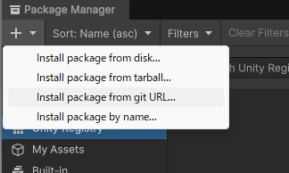
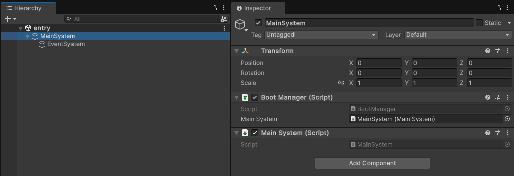
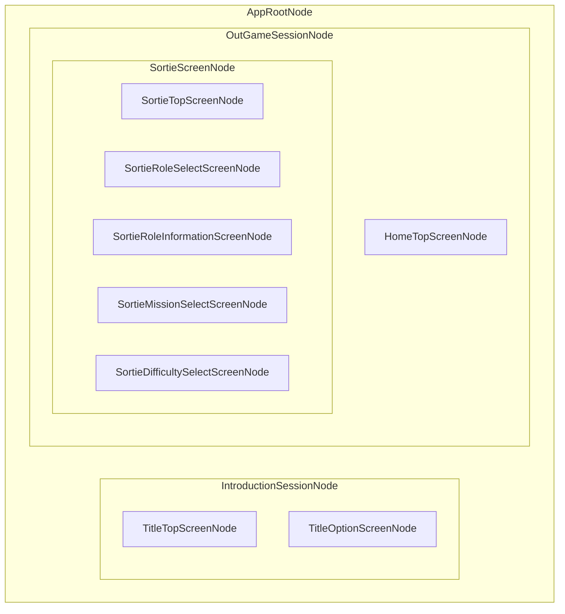
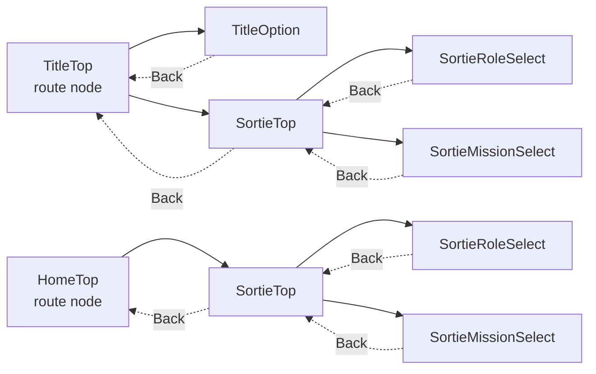
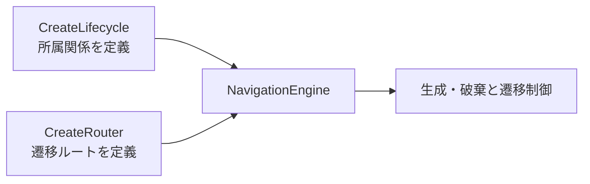

# game-framework

`com.daitokuamy.gameframework` は、Unity 6 向けのゲーム用フレームワークです。  
現在の実装は `MainSystem` を起点に、更新順制御、画面遷移、UI、演出、飛翔体、Tween、Playable、保存処理などを組み合わせてアプリ全体を組み立てる構成になっています。

このリポジトリの実体は Unity プロジェクトですが、配布対象のパッケージ本体は [Packages/com.daitokuamy.gameframework](Packages/com.daitokuamy.gameframework) にあります。

## 対応環境

- Unity 6000.0 以上
- パッケージバージョン: `2.0.0`

## インストール

### Package Manager から追加

Unity の `Window > Package Manager` を開き、`Add package from git URL...` で次を指定します。

```text
https://github.com/DaitokuAmy/game-framework.git?path=/Packages/com.daitokuamy.gameframework
```



特定のバージョンに固定したい場合は、URL の末尾に `#<revision>` を付けます。  
`<revision>` にはタグ名、ブランチ名、コミットハッシュを指定できます。

```text
https://github.com/DaitokuAmy/game-framework.git?path=/Packages/com.daitokuamy.gameframework#1.0.1
```

### `manifest.json` に直接追加

```json
{
  "dependencies": {
    "com.daitokuamy.gameframework": "https://github.com/DaitokuAmy/game-framework.git?path=/Packages/com.daitokuamy.gameframework"
  }
}
```

## 依存パッケージについて

`Packages/com.daitokuamy.gameframework/package.json` の `dependencies` は空ですが、現行コードは機能ごとに追加パッケージとの連携を前提にしています。

特に次のパッケージは導入候補として先に確認してください。

- `com.unity.cinemachine`
- `com.unity.addressables`
- `com.cysharp.unitask`
- `org.nuget.r3`
- `jp.hadashikick.vcontainer`
- `com.cysharp.memorypack`
- `com.unity.animation.rigging`
- `com.unity.splines`
- `com.daitokuamy.actionsequencer`

実際にこのリポジトリ内のサンプルが使っている構成は [Packages/manifest.json](Packages/manifest.json) を参照してください。

## 何が入っているか

現在の `com.daitokuamy.gameframework` には、主に次のランタイム機能が含まれています。

- `BootSystem`
  - `MainSystemBase`, `MainSystemStarter`, `BootManager`
  - アプリ起動とリブートの入口をまとめるための仕組み
- `Common`
  - `UpdateScheduler`, `CoroutineRunner`, `DisposableScope`, `LayeredTime`
  - 更新順制御、独自コルーチン、スコープ解放、階層的な時間制御
- `State / Transition`
  - `FiniteStateMachine`, `EnumFiniteStateMachine`
  - `StateStackRouter`, `StateTreeRouter`
  - 状態遷移と戻る操作の管理
- `NavigationSystem`
  - `NavigationEngineBuilder`, `NavigationEngine`
  - `RootNode` / `SessionNode` / `ScreenNode` ベースの画面遷移
- `AssetSystem`
  - `AssetManager`, `AssetRequest<T>`, `SceneAssetRequest`
  - `Resources`, `Addressables`, `AssetDatabase` 向けの Provider
- `UISystem`
  - `UIManager`, `UIService`, `UIScreen`, `UIDialog`, `UIAnimationPlayer`
  - プレハブやシーンから UI をロードして管理
- `TweenSystem`
  - `TweenPlayer`, `Tween`, `Sequence`, `TweenHandle`
  - `MonoBehaviour` に依存しない Tick 駆動の Tween
- `PlayableSystem`
  - `MotionPlayer`, `TimelinePlayer`, `AnimationJobConnector`
  - Animator / Timeline / Animation Job の制御
- `ProjectileSystem`
  - `ProjectileManager`
  - 弾・ビームの再生と Pool 管理
- `VfxSystem`
  - `VfxManager`, `VfxContext`, 各種 `IVfxComponent`
  - エフェクトの再生、Lod、LayeredTime 連携
- その他のゲーム向けシステム
  - `ActorSystem`, `CameraSystem`, `CutsceneSystem`, `GimmickSystem`, `CollisionSystem`, `AttachmentSystem`
- 永続化とユーティリティ
  - `LocalSave`, Pooling, Table, Math, Debug 補助など

## 最小の起動フロー

現在のコードベースで最初に押さえるべき入口は `BootSystem` です。

1. 起動用シーンに `MainSystemStarter` 派生コンポーネントを置く
2. Boot 用シーンに `BootManager` と `MainSystemBase` 派生コンポーネントを置く
3. `MainSystemStarter` が Boot シーンを読み込み、`BootManager` が `MainSystemBase` の起動処理を実行する

### `MainSystemBase` の例

```csharp
using System;
using System.Collections;
using GameFramework;
using GameFramework.BootSystem;
using UnityEngine;

[DefaultExecutionOrder(-1)]
public sealed class ExampleMainSystem : MainSystemBase {
    private UpdateScheduler _updateScheduler;

    protected override void PreStartInternal(object[] args) {
        LayeredTime.DefaultProvider = new UnityDeltaTimeProvider();
        _updateScheduler = new UpdateScheduler();
    }

    protected override IEnumerator StartRoutineInternal(object[] args) {
        yield break;
    }

    protected override IEnumerator RebootRoutineInternal(object[] args) {
        yield break;
    }

    private void Update() {
        _updateScheduler?.Update();
    }

    private void LateUpdate() {
        _updateScheduler?.LateUpdate();
    }

    private void FixedUpdate() {
        _updateScheduler?.FixedUpdate();
    }

    private void OnDestroy() {
        _updateScheduler?.Dispose();
    }
}
```

- `PreStartInternal`: 起動直前に共有システムや `UpdateScheduler` を初期化する
- `StartRoutineInternal`: 初回起動時の非同期初期化を行う
- `RebootRoutineInternal`: リブート時の再初期化を行う
- `Update` / `LateUpdate` / `FixedUpdate`: `UpdateScheduler` に更新を流す
- `OnDestroy`: 終了時に生成済みリソースを破棄する

### `MainSystemStarter` の例

```csharp
using System;
using GameFramework.BootSystem;

public sealed class ExampleMainSystemStarter : MainSystemStarter {
    public override object[] GetArguments() {
        return Array.Empty<object>();
    }
}
```

- `GetArguments`: `MainSystemBase` の起動時に渡す引数を組み立てる

`MainSystemStarter` 側では Inspector から Boot シーン名を指定します。  
`BootManager` 側では Inspector から `MainSystemBase` 派生コンポーネントを参照させます。



## 画面遷移

現行の画面遷移は `NavigationSystem` を中心に組み立てます。

- `RootNode`: アプリ全体のルート
- `SessionNode`: シーン単位や大きな遷移単位
- `ScreenNode`: 画面単位の表示と振る舞い

ノード型そのものは通常の C# クラスとして定義します。  
1 ファイルにまとめる前提ではなく、責務ごとに分けて配置してください。

### ノード型の定義例

`AppRootNode.cs`

```csharp
using GameFramework.NavigationSystem;

public sealed class AppRootNode : RootNode {
}
```

`MainMenuSessionNode.cs`

```csharp
using GameFramework.NavigationSystem;

public sealed class MainMenuSessionNode : SessionNode {
}
```

`TitleScreenNode.cs`

```csharp
using GameFramework.NavigationSystem;

public sealed class TitleScreenNode : ScreenNode {
}
```

### `NavigationEngine` の構築例

`NavigationEngineBuilder` を使った構築処理は、ノード定義とは別に `MainSystem` や専用の初期化クラスで行います。  
このリポジトリのサンプルでは [Assets/SampleGame/Scripts/Runtime/Lifecycle/MainSystem.cs](Assets/SampleGame/Scripts/Runtime/Lifecycle/MainSystem.cs) と [Assets/SampleGame/Scripts/Runtime/Lifecycle/AppNavigator.cs](Assets/SampleGame/Scripts/Runtime/Lifecycle/AppNavigator.cs) に分けて実装しています。

ここでの `Lifecycle` と `Router` は役割が異なります。

- `Lifecycle`: どの `RootNode` / `SessionNode` / `ScreenNode` が、どの親子関係で存在するかを定義する
- `Router`: `NavNodeTreeRouter` などを使って、そのノード群のあいだをどの順序と戻り先で遷移できるかを定義する

`Lifecycle` だけでは「どの画面がどのスコープに属するか」までしか決まりません。  
実際の画面遷移は、`Lifecycle` で作ったノード構造に対して `Router` が遷移ルートを与えることで成立します。


```mermaid
flowchart TB
    subgraph Root["AppRootNode"]
        direction LR

        subgraph Introduction["IntroductionSessionNode"]
            direction TB
            TitleTopL["TitleTopScreenNode"]
            TitleOptionL["TitleOptionScreenNode"]
        end

        subgraph OutGame["OutGameSessionNode"]
            direction TB
            HomeTopL["HomeTopScreenNode"]

            subgraph Sortie["SortieScreenNode"]
                direction LR
                SortieTopL["SortieTopScreenNode"]
                RoleSelectL["SortieRoleSelectScreenNode"]
                RoleInfoL["SortieRoleInformationScreenNode"]
                MissionSelectL["SortieMissionSelectScreenNode"]
                DifficultyL["SortieDifficultySelectScreenNode"]
            end
        end
    end
```

この図では、`Lifecycle` を「箱の中に箱が入っている構造」として表しています。  
どの画面がどの `SessionNode` や `ScreenNode` の内側に属しているか、という空間的な所属関係だけを持っており、この段階ではまだ遷移順は決まっていません。


```mermaid
flowchart LR
    TitleTop["TitleTop<br/>route node"]
    TitleOption["TitleOption"]
    SortieTopA["SortieTop"]
    RoleSelectA["SortieRoleSelect"]
    MissionSelectA["SortieMissionSelect"]
    HomeTop["HomeTop<br/>route node"]
    SortieTopB["SortieTop"]
    RoleSelectB["SortieRoleSelect"]
    MissionSelectB["SortieMissionSelect"]

    TitleTop --> TitleOption
    TitleTop --> SortieTopA
    SortieTopA --> RoleSelectA
    SortieTopA --> MissionSelectA

    HomeTop --> SortieTopB
    SortieTopB --> RoleSelectB
    SortieTopB --> MissionSelectB

    TitleOption -. "Back" .-> TitleTop
    SortieTopA -. "Back" .-> TitleTop
    RoleSelectA -. "Back" .-> SortieTopA
    MissionSelectA -. "Back" .-> SortieTopA

    SortieTopB -. "Back" .-> HomeTop
    RoleSelectB -. "Back" .-> SortieTopB
    MissionSelectB -. "Back" .-> SortieTopB
```

こちらは `NavNodeTreeRouter` のイメージです。  
実線が `Connect` で定義した前進遷移、破線が親ルートへ戻る `Back` を表します。

この例では `SortieTop`、`SortieRoleSelect`、`SortieMissionSelect` が 2 回ずつ出てきます。  
どちらも `Lifecycle` 上では同じ `ScreenNode` を指せますが、`Router` 上では別の位置にある別ノードとして扱われます。

重要なのは `SortieMissionSelect` から `SortieTop` に戻ること自体ではなく、その先です。  
同じ `Lifecycle` の `SortieTopScreenNode` でも、`TitleTop` 配下の位置にある `SortieTop` ならさらに `Back` すると `TitleTop` に戻り、`HomeTop` 配下の位置にある `SortieTop` なら `HomeTop` に戻ります。  
このように、戻り先は `Lifecycle` の型そのものではなく、`Router` 上の位置関係で決まります。


```mermaid
flowchart LR
    Lifecycle["CreateLifecycle<br/>所属関係を定義"]
    Router["CreateRouter<br/>遷移ルートを定義"]
    Engine["NavigationEngine"]
    Result["生成・破棄と遷移制御"]

    Lifecycle --> Engine
    Router --> Engine
    Engine --> Result
```

```csharp
using GameFramework.NavigationSystem;
using VContainer;

public sealed class AppNavigator {
    private NavigationEngine _engine;

    public void Initialize(IObjectResolver resolver) {
        _engine = NavigationEngineBuilder.Create()
            // まずは画面がどのスコープに属するかを定義する
            .CreateLifecycle<AppRootNode>(AppNodeId.Root, root => {
                root.AddSession<IntroductionSessionNode>(AppNodeId.Introduction, introduction => {
                    // タイトル関連の画面は IntroductionSession 配下に置く
                    introduction.AddScreen<TitleTopScreenNode>(AppNodeId.TitleTop)
                        .AddScreen<TitleOptionScreenNode>(AppNodeId.TitleOption);
                });

                root.AddSession<OutGameSessionNode>(AppNodeId.OutGame, outGame => {
                    // アウトゲーム側の画面は OutGameSession 配下に置く
                    outGame.AddScreen<HomeTopScreenNode>(AppNodeId.HomeTop)
                        // 出撃関連の画面は SortieScreenNode を親スコープとしてまとめる
                        .AddScreen<SortieScreenNode>(AppNodeId.Sortie, sortie => {
                            sortie.AddScreen<SortieTopScreenNode>(AppNodeId.SortieTop)
                                .AddScreen<SortieRoleSelectScreenNode>(AppNodeId.SortieRoleSelect)
                                .AddScreen<SortieMissionSelectScreenNode>(AppNodeId.SortieMissionSelect);
                        });
                });
            })
            // 次に、どの画面からどの画面へ進めるかを遷移ツリーとして定義する
            .CreateRouter(container => {
                return NavNodeTreeRouterBuilder.Create()
                    .AddRoot(AppNodeId.TitleTop, titleTop => {
                        // TitleTop を起点にした遷移ルート
                        titleTop.Connect(AppNodeId.TitleOption);
                        // SortieTop 以降の遷移は共通ヘルパーで再利用する
                        titleTop.Connect(AppNodeId.SortieTop, ConnectSortieTree);
                    })
                    .AddRoot(AppNodeId.HomeTop, homeTop => {
                        // HomeTop を起点にしても同じ SortieTop 系ルートを使う
                        homeTop.Connect(AppNodeId.SortieTop, ConnectSortieTree);
                    })
                    .Build(container);
            })
            // Lifecycle と Router をまとめて NavigationEngine を生成する
            .Build(resolver);
    }

    private static void ConnectSortieTree(NavNodeTreeRouterNodeBuilder sortieTop) {
        // 同じ SortieTop の下にぶら下がる遷移をひとまとめにしている
        sortieTop.Connect(AppNodeId.SortieRoleSelect);
        sortieTop.Connect(AppNodeId.SortieMissionSelect);
    }

    public void Update() {
        // 毎フレーム呼ぶことで遷移処理を進行させる
        _engine.Update();
    }
}
```

この例では各関数が次の役割を持ちます。

- `Initialize`: 画面遷移全体の初期化を行う
- `CreateLifecycle`: `RootNode` / `SessionNode` / `ScreenNode` の親子関係を登録する
  `SortieScreenNode` のような中間スコープもここで定義する
- `CreateRouter`: `NavNodeTreeRouter` 用の遷移ツリーを組み立てる
- `ConnectSortieTree`: 同じ `SortieTop` 配下の遷移定義を複数ルートで再利用する
- `Build`: 定義した内容から `NavigationEngine` を生成する
- `Update`: 毎フレーム `NavigationEngine` を進行させる

このように、画面の所属関係は `CreateLifecycle`、画面間の移動ルールは `CreateRouter` で分けて記述します。  
`NavigationEngine` はこの 2 つを組み合わせることで、画面の生成・破棄と、前進・戻るを含む遷移制御をまとめて扱えます。

### 遷移実行の例

構築した `NavigationEngine` は、`MainSystem` やナビゲーション専用クラスから呼び出します。

```csharp
_engine.TransitionTo<TitleScreenNode>(AppNodeId.Title, new CrossTransition());
_engine.Back();
```

- `TransitionTo<TitleScreenNode>(...)`: 指定した画面へ遷移を開始する
- `Back()`: ルーターで定義した戻り先へ戻る

## UI の考え方

UI は `UIManager` を中心に扱います。

- `IUIAssetLoader` 経由で UI シーンまたは UI プレハブをロードする
- 読み込まれた `UIService` が `UIScreen` / `UIDialog` を管理する
- `UIManager` 自体を `UpdateScheduler` に登録して更新する

サンプル実装は以下が参考になります。

- [Assets/SampleGame/Scripts/Runtime/Lifecycle/MainSystem.cs](Assets/SampleGame/Scripts/Runtime/Lifecycle/MainSystem.cs)
- [Assets/SampleGame/Scripts/Runtime/Lifecycle/AppNavigator.cs](Assets/SampleGame/Scripts/Runtime/Lifecycle/AppNavigator.cs)

## ドキュメント方針

README では導入手順と全体像を中心に扱います。  
各機能の詳細説明は、今後 `docs/overview/` 以下に順次まとめていく想定です。

現時点で具体的な実装を追う場合は、次のファイルが入口になります。

- [Packages/com.daitokuamy.gameframework](Packages/com.daitokuamy.gameframework)
- [Assets/SampleGame/Scripts/Runtime/Lifecycle/MainSystem.cs](Assets/SampleGame/Scripts/Runtime/Lifecycle/MainSystem.cs)
- [Assets/SampleGame/Scripts/Runtime/Lifecycle/AppNavigator.cs](Assets/SampleGame/Scripts/Runtime/Lifecycle/AppNavigator.cs)
